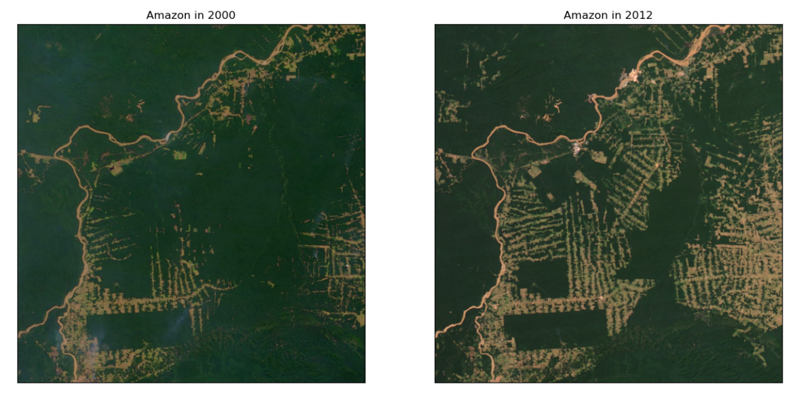

# Amazon Deforestation in Rondonia, Brazil rate between 2000 and 2012 by cumputer vision

over a distance of 100 km 

source images: NASA’s Earth Observatory   
link: https://earthobservatory.nasa.gov/WorldOfChange/Deforestation 

## Description

The ultimate goal of this project is to employ computer vision techniques and data analysis to quantify deforestation in the Rondônia region of the Amazon forest, spanning just over a decade. This will involve utilizing NASA satellite images and applying techniques such as **[image processing], [mathematical morphology operators (erosion, dilation, closure, etc.)], and [convolution]**. The aim is to utilize these methods to accurately measure and understand the extent of deforestation in this specific region over the given timeframe.

## License

## Notes and Suggestions

If you have any comments, suggestions, or questions, feel free to share them by opening a new issue. We appreciate community feedback and are open to continuous improvement of this project.

Thank you for your participation and your interest in this project!
